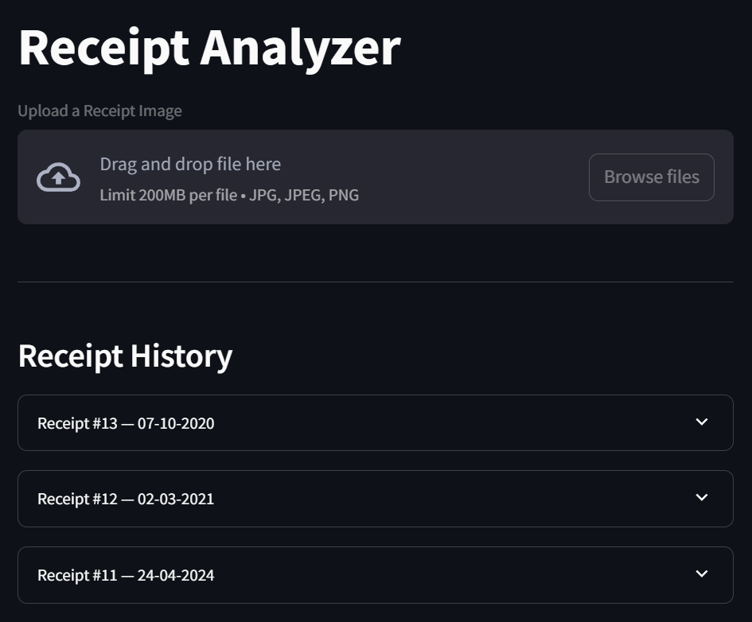

# Receipt Analyzer Dashboard 🧾

This Streamlit app extracts key details from receipt images (date, amount, merchant, etc.) using Tesseract OCR and provides a categorized breakdown with visualizations.

## 📌 Features
- Upload receipt images
- Extracts information using OCR
- Categorizes expenses (Food, Travel, etc.)
- Displays expense summaries and pie charts

## 📷 Sample Screenshot



## 🚀 How to Run Locally
```bash
git clone https://github.com/sarahMzarifi/receipt-analyzer.git

# Navigate into the project folder
cd receipt-analyzer

# Install dependencies
pip install -r requirements.txt

# Launch the app
streamlit run dashboard.py
